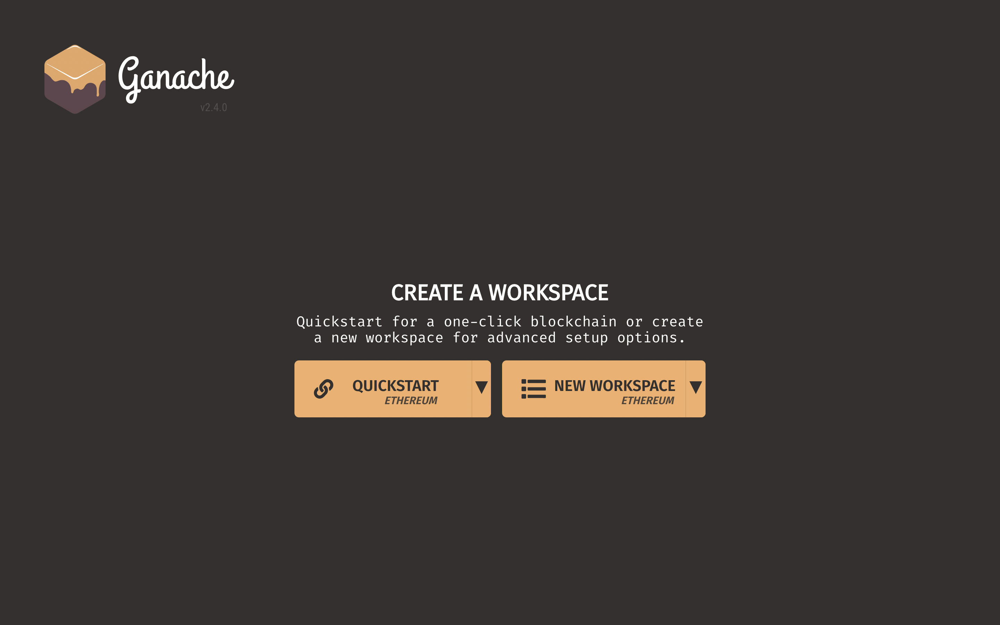
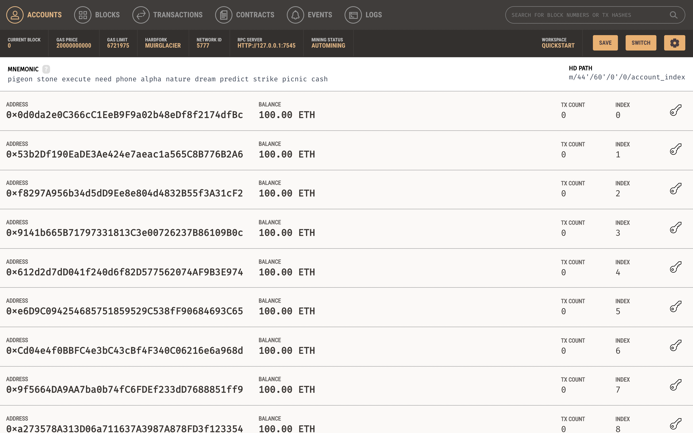
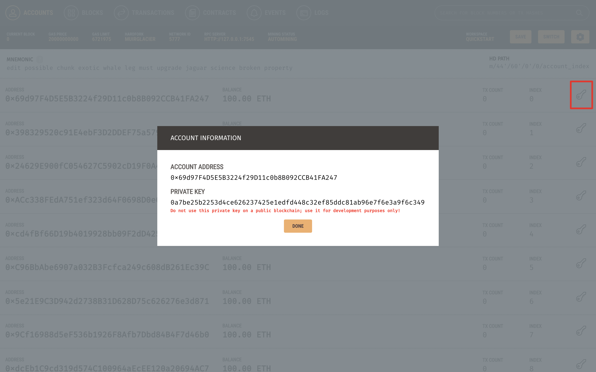

# Mastering Ethereum

## Environment 
- macOS 10.15.4
- ethereum network: [Ganache@v2.4.0]

[Ganache@v2.4.0]: https://github.com/trufflesuite/ganache/tree/v2.4.0

### Ganache basics
1. Open the Ganache app
  
2. Click 'QUICKSTART' to enter the main panel
  
3. Show keys to use in Go code examples later
  

## Ethereum Client

- The Geth client in use is the official docker container [ethereum/client-go](https://hub.docker.com/r/ethereum/client-go) tagged at `alltools-v1.9.19`
- The installation goes as

  ```bash
  docker pull ethereum/client-go:alltools-v1.9.19
  ```

- Basic usage

  ```bash
  docker run --rm ethereum/client-go:alltools-v1.9.19 [executable] [options]
  ```

  - where the avaiable `executable` is listed as the official [Executables](https://github.com/ethereum/go-ethereum#executables) section

## Playground

The playground implements a simple commander handling jobs such as

- Generate accounts
- List/Unlock accounts

All the utility API is implemented in the `playground/eth` package

## Work in Progress

- [x] Chapter 01. What Is Ethereum?
- [x] Chapter 02. Ethereum Basics
- [x] Chapter 03. Ethereum Clients
- [ ] Chapter 04. Cryptography
  - [ ] the ICAP demo
- [x] Chapter 05. Wallets
- [x] Chapter 06. Transactions
  - Maybe js version for demo later
- [ ] Chapter 07. Smart Contracts and Solidity
- [ ] Chapter 09. Smart Contract Security
- [x] Chapter 10. Tokens
- [x] Chapter 11. Oracles
