# Chapter 02. Ethereum Basics

## Ether Currency Units

- **Name**: `ether`, a.k.a., **ETH**, Ξ, ♦
- The smallest subdivision of `ether` is `wei`, which is `10`<sup>-18</sup>
- Ethereum is the system, ether is the currency
- Ether denominations and unit names as

  | Value (in `wei`) | Common Name | SI Name               |
  | ---------------- | ----------- | --------------------- |
  | 1                | `wei`       | Wei                   |
  | 10<sup>3</sup>   | `Babbage`   | Kilowei or femtoether |
  | 10<sup>6</sup>   | `Lovelace`  | Megawei of picoether  |
  | 10<sup>9</sup>   | `Shannon`   | Gigawei or nanoether  |
  | 10<sup>12</sup>  | `Szabo`     | Micoether or mico     |
  | 10<sup>15</sup>  | `Finney`    | Milliether or milli   |
  | 10<sup>18</sup>  | `Ether`     | Ether                 |
  | 10<sup>21</sup>  | `Grand`     | Kiloether             |
  | 10<sup>24</sup>  |             | Megaether             |

## Choosing an Ethereum Wallet

- **DEFINITION**: A software app that helps to manage Ethereum accounts by means of holding keys,
  creating and broadcasting tx for users
- Way to switch wallets
  - Make a tx sending funds from the old wallet to the new one
  - Export private keys and import them into the new one
- 3 types of wallets

  - Mobile wallet
  - Desktop wallet
  - Web-based wallet

  > **TIP** Wallet apps should be downloaded from trusted sources only

- Some good starter wallets
  - MetaMask
    - A browser extension running in Chrome/Firefox/Opera/Brave Browser
  - Jaxx
    - A multiplatform and multicurrency wallet that runs on a variety of operating systems,
      including Android, iOS, Windows, macOS, and Linux
    - Avaiable for mobile or desktop
  - MyEtherWallet(MEW)
    - Web-based
  - Emerald Wallet
    - Aim at ETC
    - Compatible with other Ethereum-based blockchain
    - Desktop-based for Windows/macOS/Linux

## Control and Responsibility

- One crucial aspect is the capability of controling user's private keys, which control access to
  funds and smart contracts
- A few tips
  - Do not improvise security. Use tried-and-tested standard approaches
  - The more important the account, the higher security measures should be taken
  - The highest security is gained from an air-gapped device, but this level is not required for
    every account
  - Never store your private key in plain form, especially digitally
  - The digital "keystore" file should encrypt private keys with strong passwords which need backing
    up and keeping privately
  - Do not store any passwords in digital documents, digital photos, screenshots, online drives,
    encrypted PDFs, etc. Again, do not improvise security. Use a password manager or pen and paper
  - Back up a key (as a mnemonic word sequence) physically and immediately and store it in a locked
    drawer or safe
  - Before transferring any large amounts (especially to new addresses), first do a small test
    transaction (e.g., less than \$1 value) and wait for confirmation of receipt
  - Testing the newly created accounts by transfering to and receiveing from them. In case of
    anything wrong, find it out.
  - Public block explorers helps to trace the accepted tx at the expense of user's privacy leaked by
    the revealed addresses

## Getting Started with MetaMask

- Source: https://chrome.google.com/webstore/detail/metamask/nkbihfbeogaeaoehlefnkodbefgpgknn
  - Shows the ID `nkbihfbeogaeaoehlefnkodbefgpgknn` in the address bar
  - Is offered by https://metamask.io
  - Has more than 1,600 reviews
  - Has more than 1,000,000 users

### Creating a Wallet

> The MetaMask shown below is tagged with version 6.2.2

1. See the welcome page and click the **GETTING STARTED** button  
   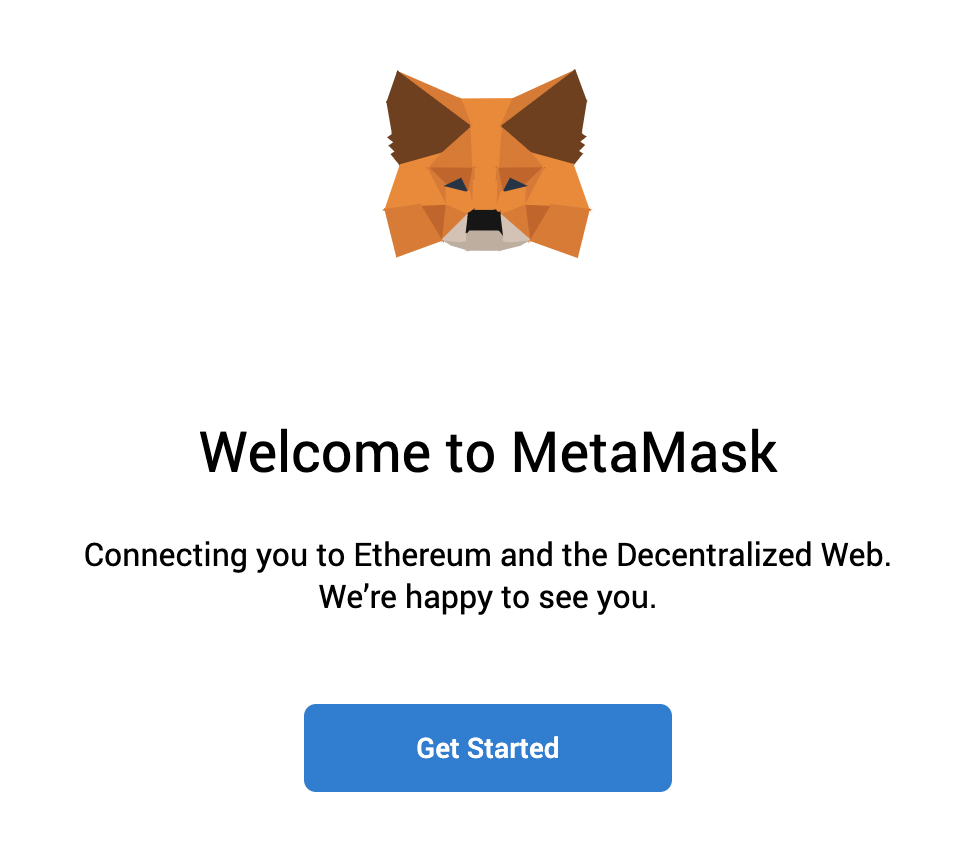
2. Advance by clicking the **CREATE A WALLET** button  
   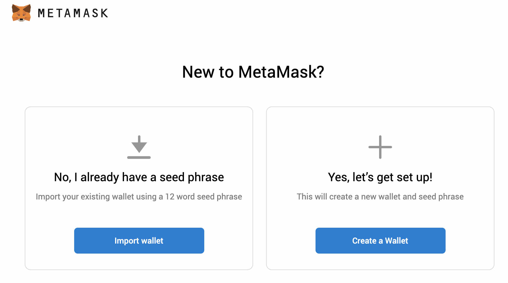
3. **I AGREE** the _Help Us Improve MetaMask_ statements  
   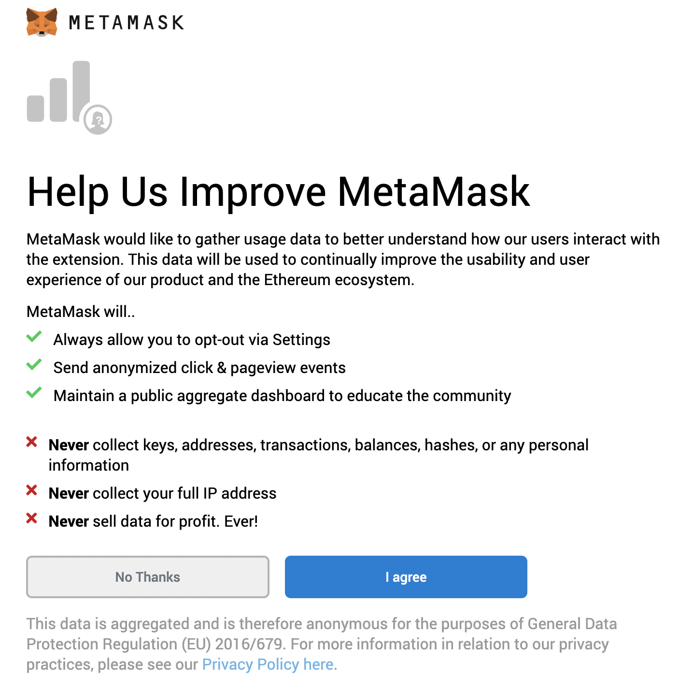
4. Create Password  
   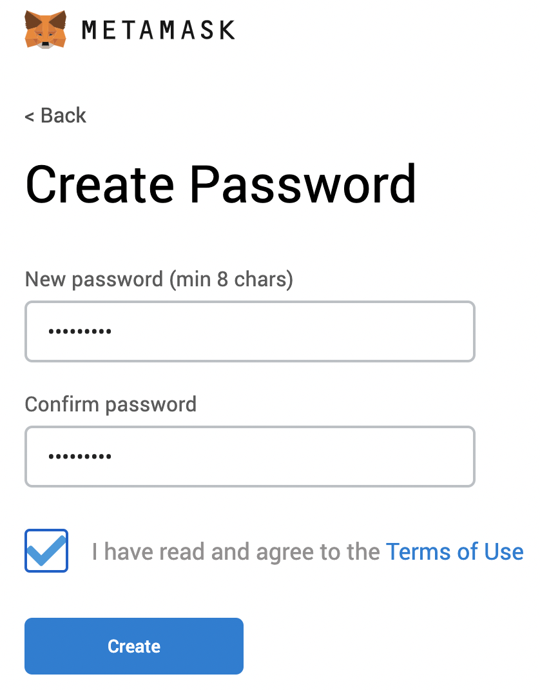
5. Backup secret phrase, which would ask us to unlock the secret words with the password set in the
   previous step  
   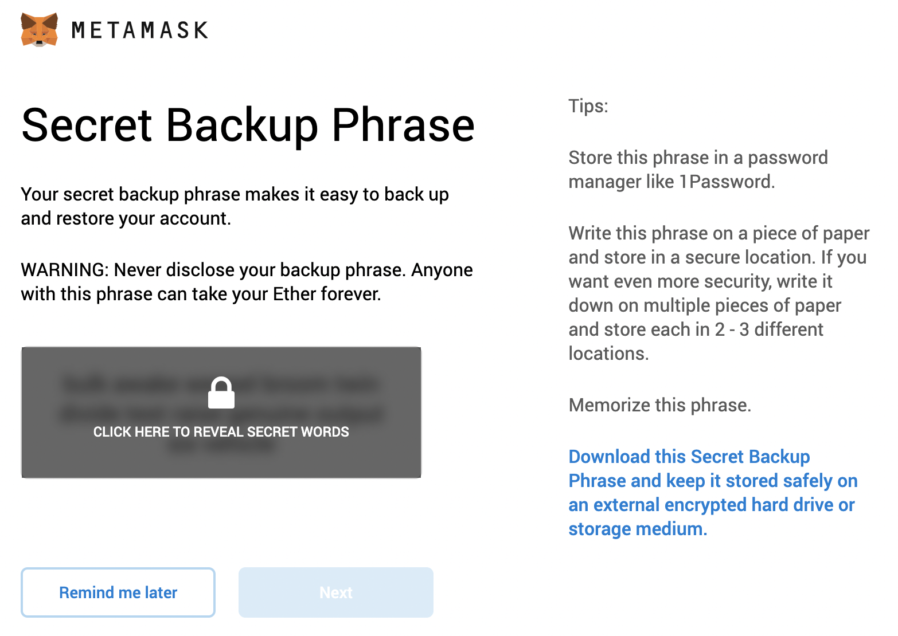
6. Confirm your Secret Backup Phrase  
   
7. Awarded with congratulations page  
   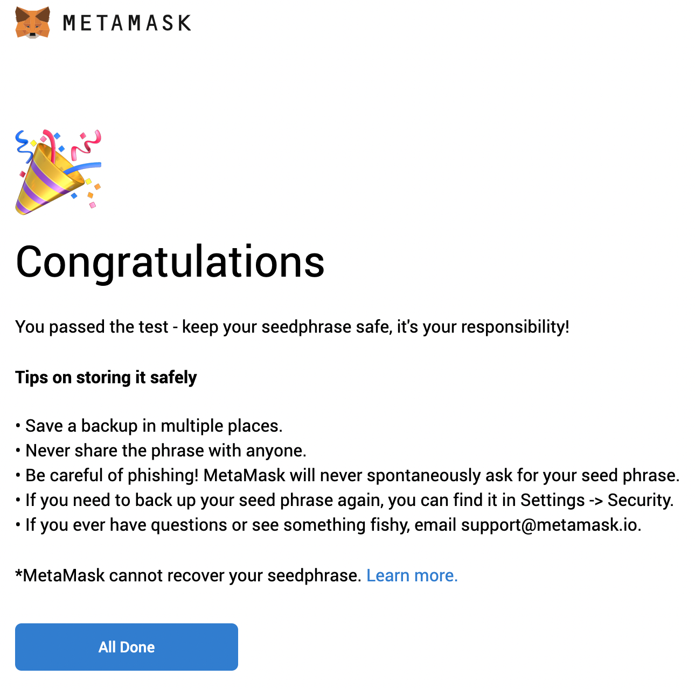
8. Finally, enter the main panel  
   

### Switching Networks

- **Main Ethereum Network**: The main public Ethereum blockchain. Real ETH, real value, and real
  consequences
- **Ropsten Test Network**: Ethereum public test blockchain and network. ETH on this network has
  no value
- **Kovan Test Network**: Ethereum public test blockchain and network using the Aura consensus
  protocol with proof of authority (federated signing). ETH on this network has no value. The Kovan
  test network is **supported by Parity only**. Other Ethereum clients use the Clique consensus
  protocol, which was proposed later, for proof of authority-based verification.
- **Rinkeby Test Network**: Ethereum public test blockchain and network, using the Clique consensus
  protocol with proof of authority (federated signing). ETH on this network has no value.
- **Localhost 8545**: Connects to a node running on the same computer as the browser. The node can
  be part of any public blockchain (main or testnet), or a private testnet.
- **Custom RPC**: Allows you to connect MetaMask to any node with a Geth-compatible Remote
  Procedure Call (RPC) interface. The node can be part of any public or private blockchain

### Getting Some Test Ether

1. Switch MetaMask to the **Ropsten Test Network**, and click **Buy**
   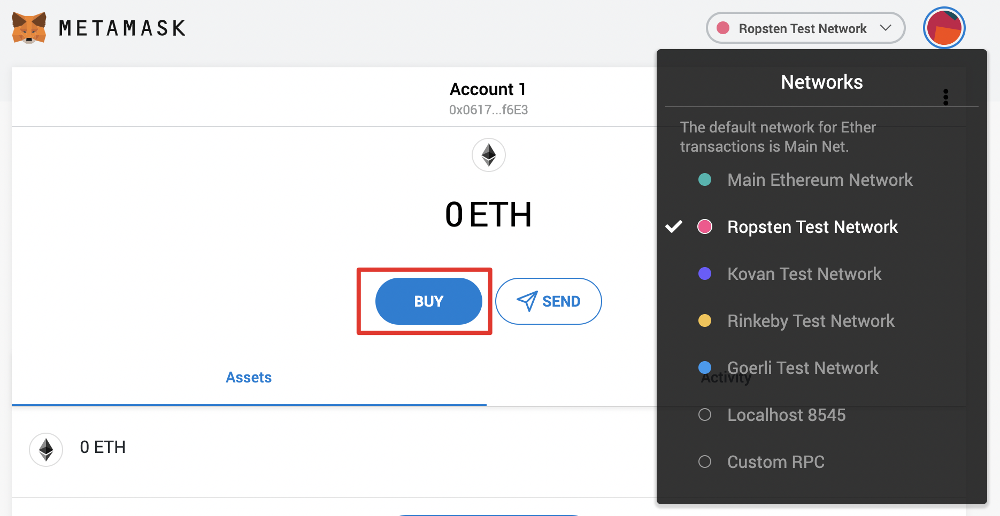
2. Pick the **GET ETHER** option to navigate to the faucet app, which would ask MetaMask for wallet
   address to send test ether to  
   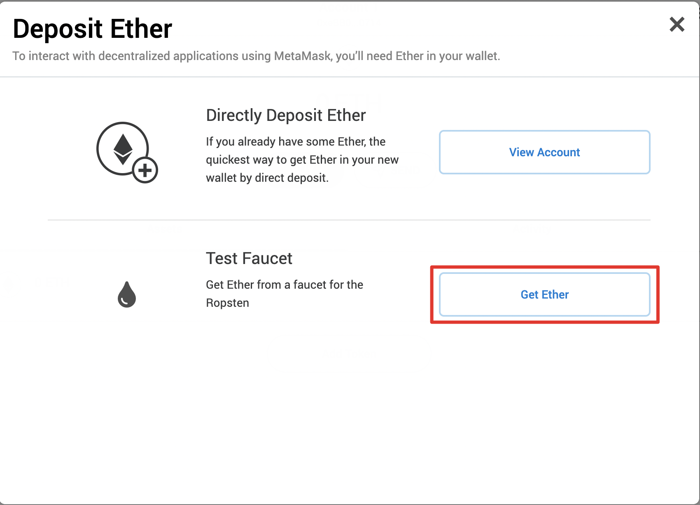
3. Click the green "request 1 ether from faucet" button, which will request account connection
  
  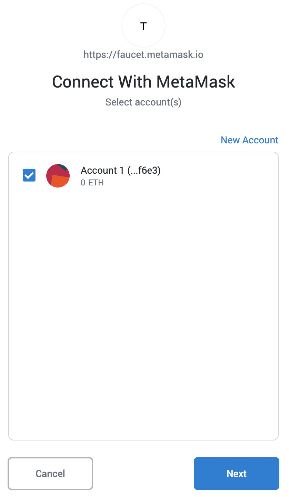
  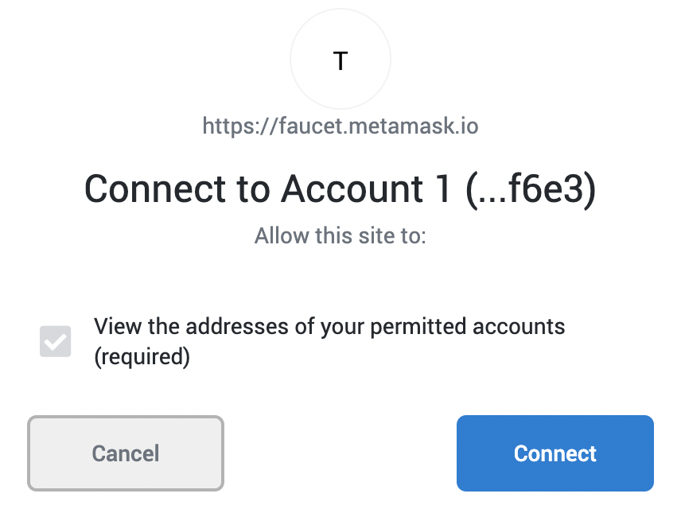
4. In a few seconds, the new tx (indexed by ID
   `0x02d45c7c4b9a797b52505b79326f56c37a71548f608445d6d596f93d8dd322f8` below) be mined by the
   Ropsten miners and your MetaMask wallet will show a balance of 1 ETH
  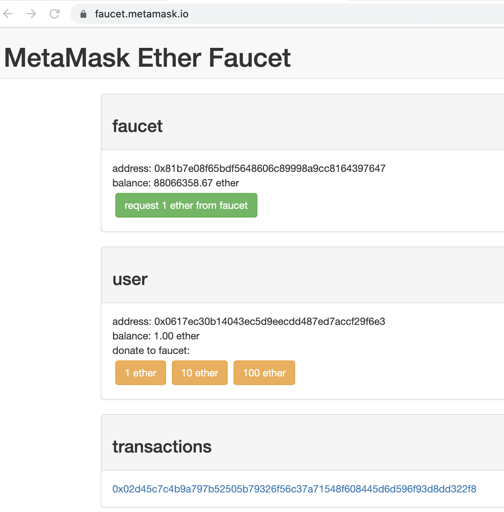
5. Click on the **transaction ID** (in the faucet app panel) and your browser will take you to a
   block explorer
   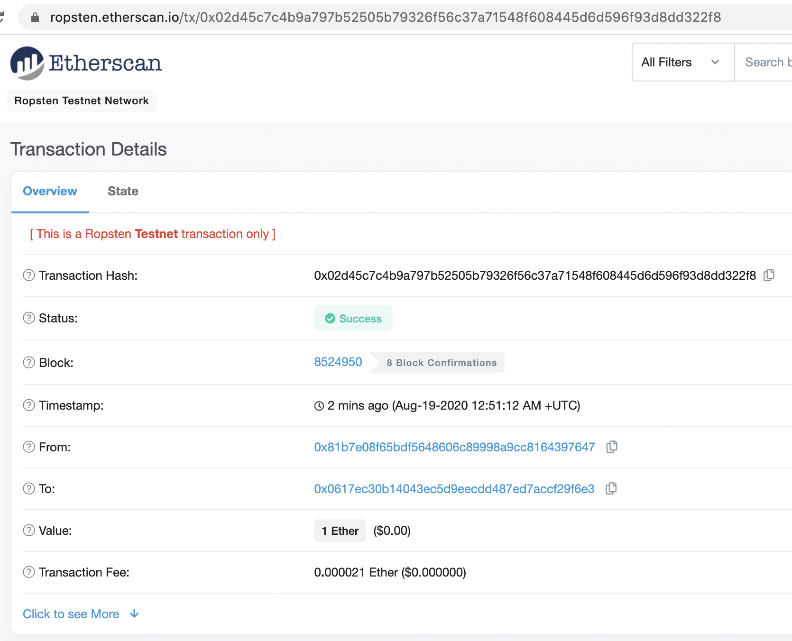

### Sending Ether from MetaMask

- The option to "donate" 1 ETH to the faucet is available for returning the remainder of your test
  ether, so that someone else can use it next

  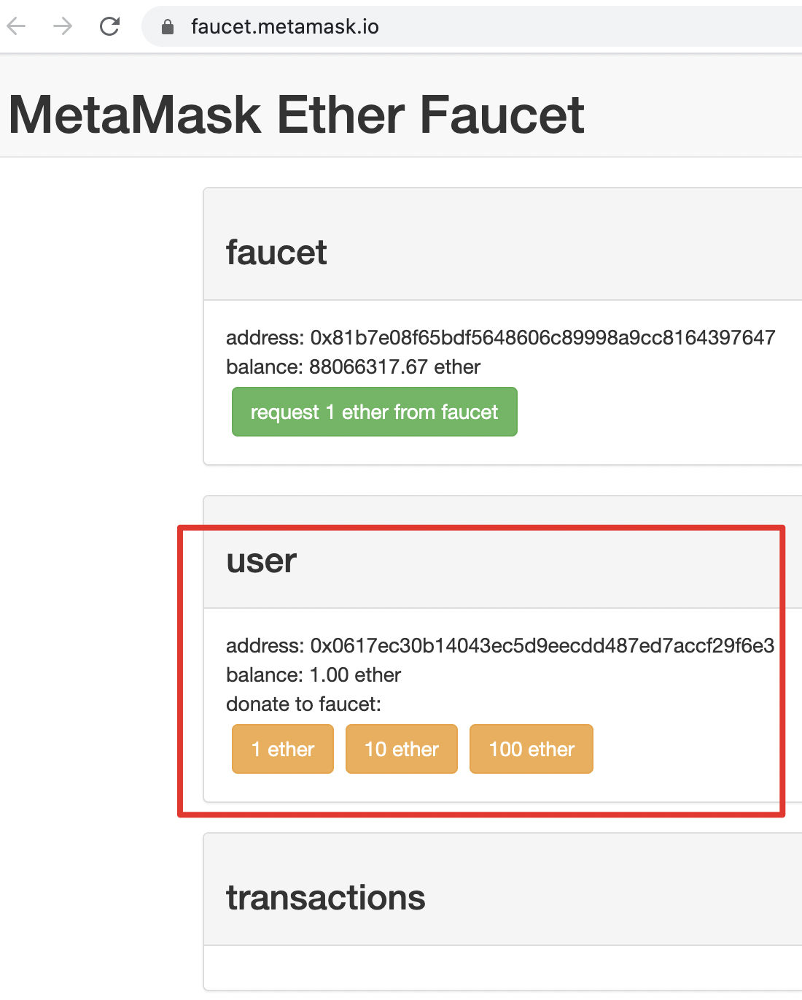

- Every Ethereum transaction requires payment of a fee, which is collected by the miners to
  validate the transaction
  > Fees are required on the test networks too. Without fees, a test network would behave
  > differently from the main network, making it an inadequate testing platform. Fees also protect
  > the test networks from DoS attacks and poorly constructed contracts (e.g., infinite loops),
  > much like they protect the main network.

### Exploring the Transaction History of an Address

- Tool: The ropsten.etherscan.io block explorer
- **HOW**
  1. Click the **Details** button under the account name  
     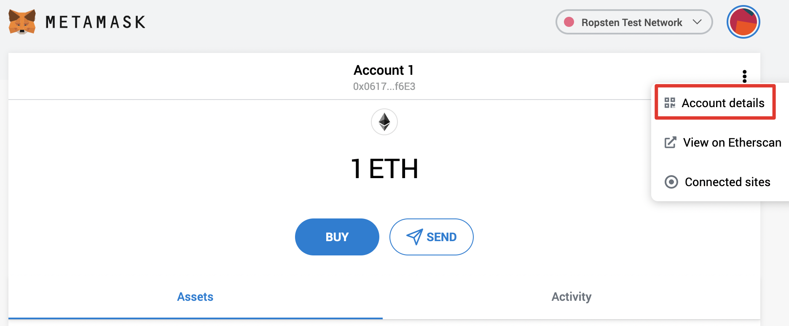
  2. Pick the **VIEW ACCOUNT ON ETHERSCAN** on the popup dialog  
     
  3. A sample page goes as
     

## Introducing the World Computer

- Ether is meant to be used to pay for running smart contracts, which are computer programs that
  run on an emulated computer called the **Ethereum Virtual Machine** (EVM)
- The EVM is a global singleton, meaning that it operates as if it were a global, single-instance
  computer, running everywhere
- Each node on the Ethereum network runs a local copy of the EVM to validate contract execution,
  while the Ethereum blockchain records the changing state of this world computer as it processes
  transactions and smart contracts

## Externally Owned Accounts (EOAs) and Contracts

- Externally owned accounts are those that have a **private key**; having the private key means
  control over access to funds or contracts
- A contract account
  - Has smart contract code, which a simple EOA can't have
  - A contract account does not have a private key
  - It is owned (and controlled) by the logic of its smart contract code: the software program
    recorded on the Ethereum blockchain at the contract account's creation and executed by the EVM
- Contracts have addresses, just like EOAs, equipping them to send and receive ether
- A tx destined for a contract address can call functions within the contract with tx's data,
  causing that contract to run in the EVM
- A contract account cannot initiate a tx due to a lack of private keys
- Contracts can react to transactions by calling other contracts
- A typical DApp programming pattern is to have Contract A calling Contract B in order to maintain
  a shared state across users of Contract A

## A Simple Contract: A Test Ether Faucet

- Solidity is the dominant choice for smart contract programming
- Use case: A faucet coded as [Faucet.sol](examples/Faucet.sol)

  - controlled by a contract
  - gives out ether to any address that asks
  - can be refilled periodically

- Comments
  - For humans to read and are not included in the executable EVM bytecode
  - Usually put on the line before the code to explain, or sometimes on the same line
  - Start with two forward slashes: `//`
- The contract definition includes all the lines between the curly braces (`{}`), which define a **scope**
- The built-in `require()` tests a precondition
- Statements need to be terminated with a semicolon in Solidity
- The `msg` object is one of the inputs that all contracts can access. It represents the transaction
  that triggered the execution of this contract
- The attribute `msg.sender` is the sender address of the transaction
- The function `transfer` is a built-in function that transfers ether from the current contract to
  the address of the sender
- `receive`: **Fallback**/**Default** function
  - Called if the transaction that triggered the contract didn't name any of the declared functions
    in the contract, or any function at all, or didn't contain data
  - Contracts can have one such default function (without a name) and it is usually the one that
    receives ether

## Compiling the Faucet Contract

- Tool: `solc` installed with `yarn global add solc@v0.7.0`, which would produce an executable
  named `solcjs` accessible across the OS
- Compiling command goes as
  ```bash
  solcjs --bin Faucet.sol
  ```

## Creating the Contract on the Blockchain

- Registering a contract on the blockchain involves creating a special transaction whose
  destination is the **zero address** `0x0000000000000000000000000000000000000000` (40 zeros)
- Deploy with help of [Remix][remix]
  1. Navigate to the Remix IDE by clicking [remix]
    
  2. Add a new tab by clicking on the circular plus sign in the top-left toolbar to create a new
    file named `Faucet.sol`
    
  3. Copy and paste the code of local example `Faucet.sol` into the the new created `Faucet.sol`
    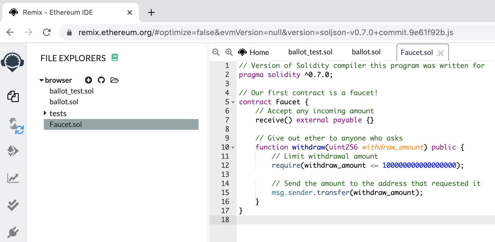
  4. Click the **Start to compile** button under the `compile` tab to compile the contract into
    bytecodes
     
  5. Switch to `Run` tab and select `Injected Web3` in the Environment drop-down selection box,
    which will connect the Remix IDE to the MetaMask wallet, and through MetaMask to the Ropsten test network
     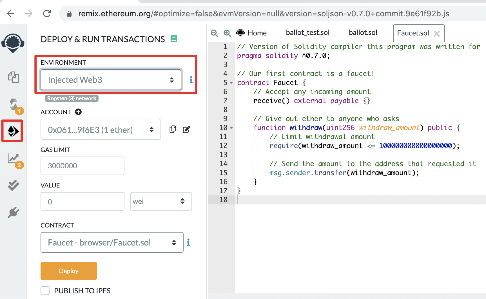
  6. Confirm the contract focused is `Faucet` and click `Deploy` button to trigger the deployment
     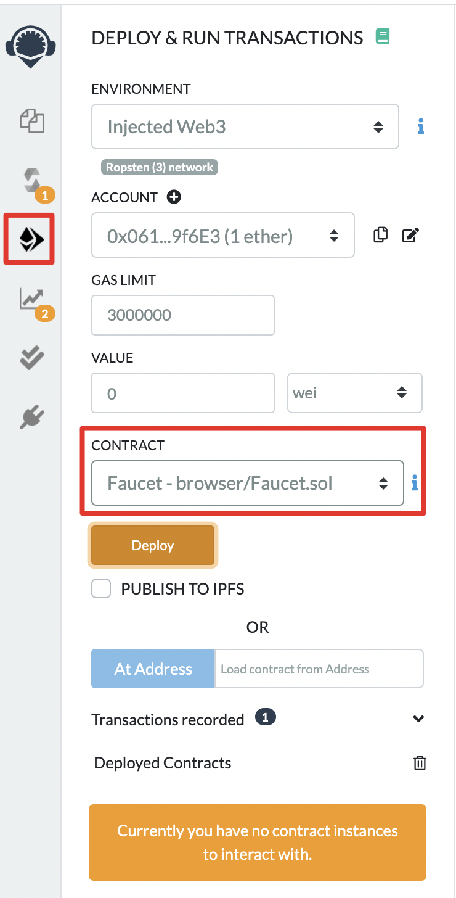
  7. Confirm the deployment in MetaMask
     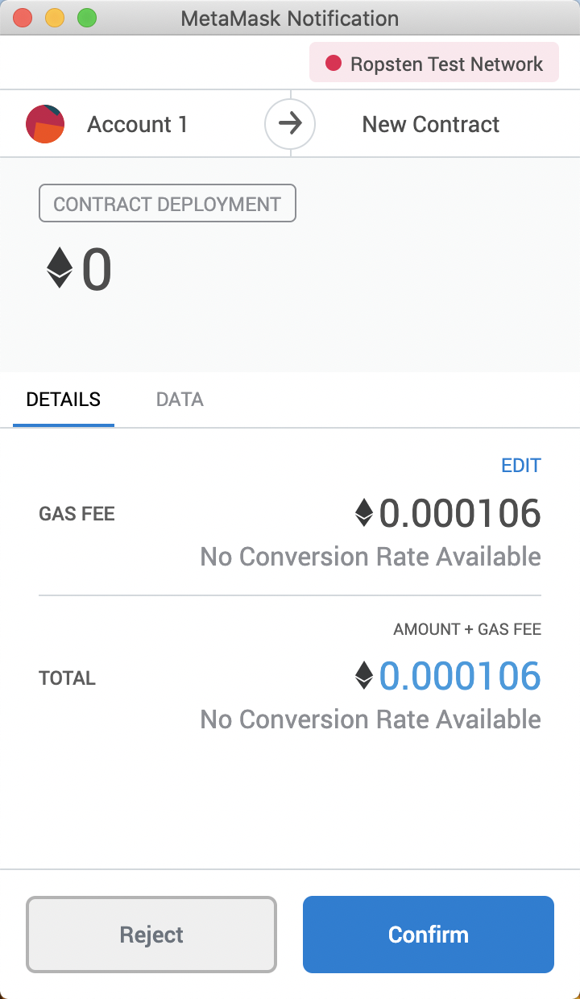
## Interacting with the Contract

### Viewing the Contract Address in a Block Explorer

1. Copy the contract address
   
2. Parse the copied address into the Etherscan explorer and enter, you should see
   

### Funding the Contract

- **HOW**
  1. Parse the contract address into the **Send ETH** panel of MetaMask
    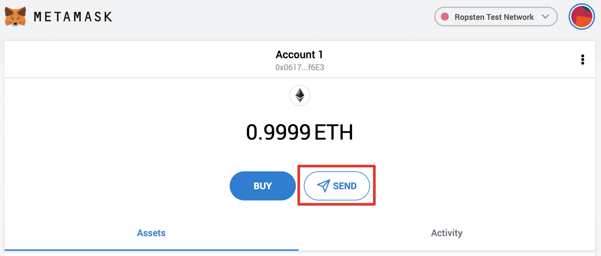
  2. Fill in some ether you want, and click the **NEXT** button
    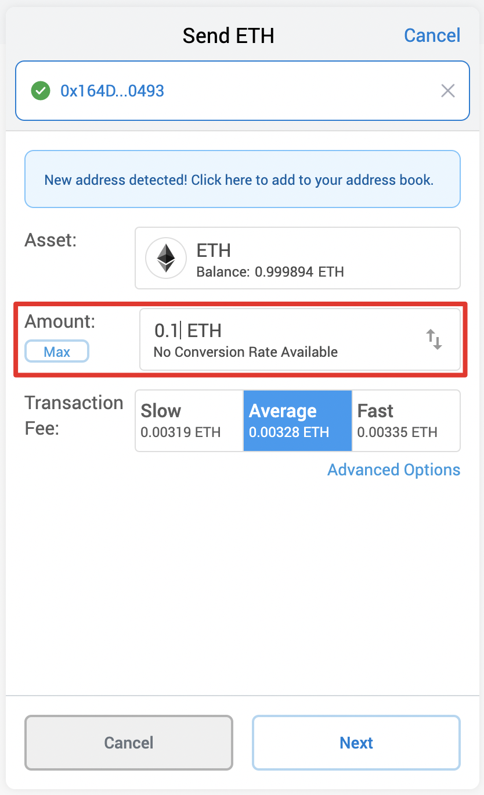
  3. Confirm the sending by click **Confirm** button
    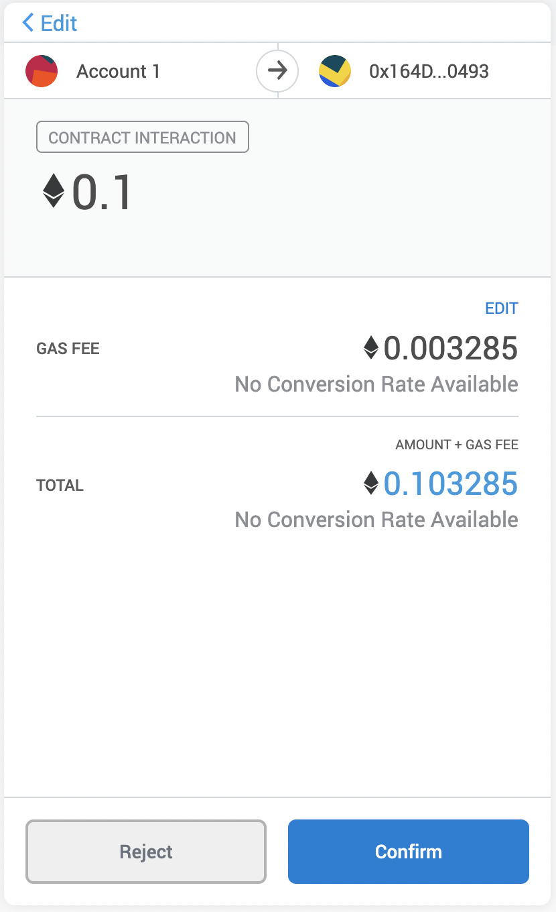
  4. Wait for a while, we should see the balance of the contract is changed to 0.1 Ether
    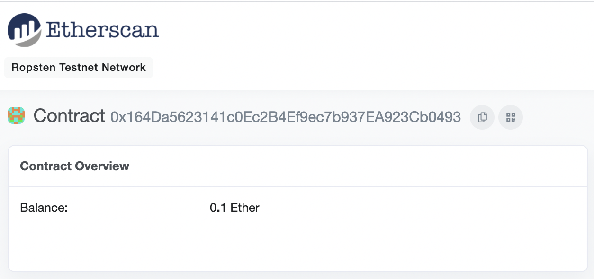

### Withdrawing from Our Contract

- **HOW**: In the `Run` tab of Remix IDE

  1. Fill in amount (`10000000000000000` wei, i.e. 0.01 ether in our case) to withdraw in the
    textfield to the right of the `withdraw` button
    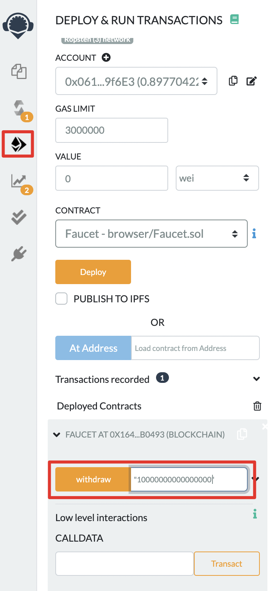
  2. Confirm the action in the popup MetaMask modal
    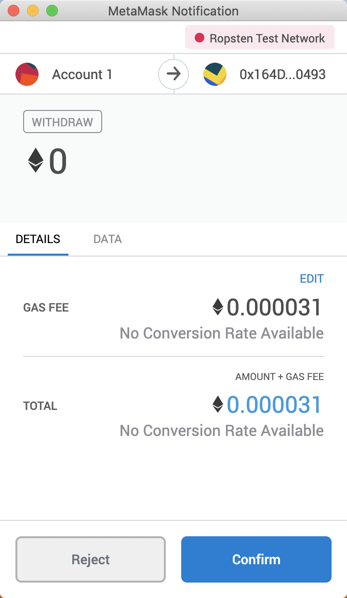

  > Due to a limitation in JavaScript, a number as large as 10<sup>17</sup> cannot be processed by
  > Remix. Instead, we enclose it in double quotes, to allow Remix to receive it as a string and
  > manipulate it as a `BigNumber`

- Navigate to the contract page in 
  [etherscan](https://ropsten.etherscan.io/address/0x164da5623141c0ec2b4ef9ec7b937ea923cb0493#internaltx),
  we should see
  - Contract's balance has changed to 0.09 Ether
  - The withdraw transfer originated from the contract code is an **internal transaction** (a.k.a.,
    **message**)
  

## Conclusions

[remix]: https://remix.ethereum.org/#optimize=false&evmVersion=null&version=soljson-v0.7.0+commit.9e61f92b.js
